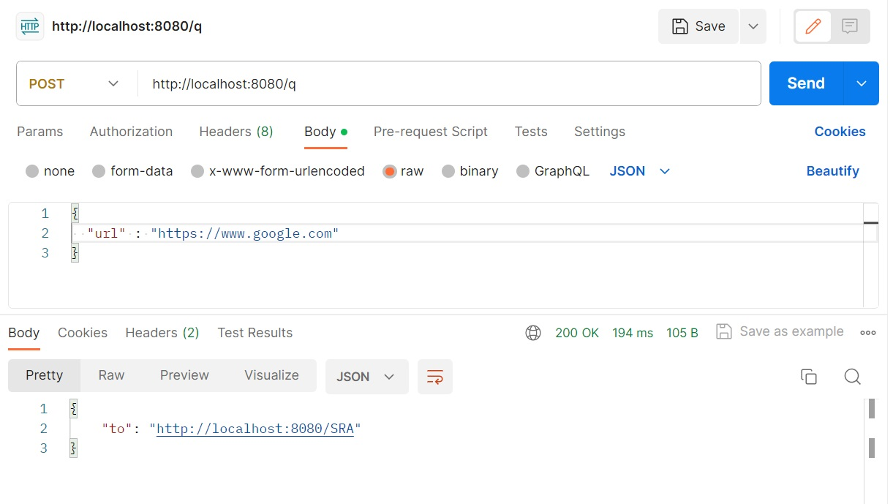

# UrlShortener : A SpringBoot Demo Application

Ths application is the backend api part of an URL shortener that reduces the length of URL. It is intended to aid the demonstration and testing of the related technologies.

It is built using [Spring Boot](http://projects.spring.io/spring-boot/) and [Redis](https://redis.io/), and is packaged in Docker containers.

## Usage

